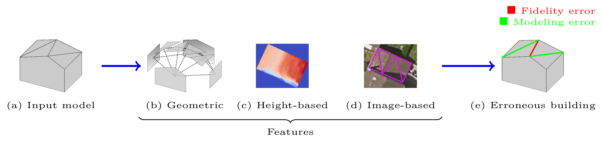

# Quality evaluation of 3D building models: a scalable approach

The automatic generation of 3D building models from geospatial data is now a standard procedure.
An abundant literature covers the last two decades and several softwares are now available.
However, urban areas are very complex environments.
Inevitably, practitioners still have to visually assess, at city-scale, the correctness of these models and detect frequent reconstruction errors.
Such a process relies on experts, and is highly time-consuming with approximately 2 hour/km²/expert.
This work proposes an approach for automatically evaluating the quality of 3D building models.
Potential errors are compiled in a novel hierarchical and modular taxonomy.
This allows, for the first time, to disentangle fidelity and modeling errors, whatever the level of details of the modeled buildings.
The quality of models is predicted using the geometric properties of buildings and, when available, Very High Resolution images and Digital Surface Models.
A baseline of handcrafted, yet generic, features is fed into a RF or SVM classifiers.
Advanced features, relying on graph kernels as well as Scattering Networks, were proposed to better take into consideration structure.
Both multi-class and multi-label cases are studied: due to the interdependence between classes of errors, it is possible to retrieve all errors at the same time while simply predicting correct and erroneous buildings.
The proposed framework was tested on three distinct urban areas in France with more than 3,000 buildings.
80 to 99% F-score values are attained for the most frequent errors.
For scalability purposes, the impact of the urban area composition on the error prediction was also studied, in terms of transferability, generalization, and representativeness of the classifiers.
It shows the necessity of multi-modal remote sensing data and mixing training samples from various cities to ensure a stability of the detection ratios, even with very limited training set sizes.

**Keywords.** 3D urban modeling, Buildings, Dataset, Quality assessment, Error taxonomy, Error detection, Aerial imagery, Very High Resolution, Digital Surface Model, Geometry, Statistical learning, Multi-label classification.

اصّناعة ديال انّمادج تولاتية لبعاد ديال لبنايات بطريقة تلقاءيّة ولّات معمول بيها هاد ليّام.
كاين فهاد عشرين عام الّخرّة عدد كافي من لمراجع لّي اتّطرقات لهاد لموضوع، زيد عليها عدد ديال لبارامج.
لموشكيلة أنّاهو لمجالات لحضريّة منوّعة بزّاف، اشّي الّي تيخلّي أنّا، بطريقة ولّا اخرة، أين موقاربة تقدر تغلط.
هادشي تيدفع فلواقع أنّانا نتءكّدو باشّوف من اصّحة ديال انّمادج، لقاضيّة الّي تاتاخد عاداتان 2 سوايع فكيلومطرمربع لكلّا بناية لكلّا خبير.
على ود هادشي تانقتارحو طريقة باش نقيّمو انّمادج ديال لبنايات تلقاءيّان.
أول حاجة هيّا أنّانا صنّفنا لأغلاط الّي تقدر تخسّر اّنمادج بلوحدات أو بشكل هرميّ.
هاد اتّفراز تيفرّق لأول مرّة مابين لمشاكيل ديال اشّكل من لأغلاط فادّقة.
باش نقشعو هاد لأغلاط الّي عرّفنا، تانعوّلو على لخاصّيات لهندسية ديال انّمودج الّي تانتحقّقومنّو، بازيّادة على خاصيّات برّانيّة منّي تانقارنو انّمودج مع تصويرة عموديّة ولّا تصويرة ديال لعمق.
فهاد لخدمة الّي درنا، قتارحنا أولا خاصيّات بصيطة أوليّة باش نتءكدّو من لمقاربة ديالنا.
هاد لخاصيّات تاندوزوهوم لموصنّيفات بحال لمفرّز بأوسع هامش أولّا لغابة ديال اتّفراق لعلّا وي.
فلمحالة اتّالية، قتارحنا خاصيّات آخرة باش نتحقّقو من كولّا نمودج.
هاد لخاصيّات تيعوّلو على نفس لمعطايات فادّخلة، والاكن تاتعتمد علا طريقات مقدّمة كتر.
توكدنا من هاد اتّسلسل باتّجربة على تلاتة ديال لمدينات ففرانسا: **ايلونكور** (2009 بناية)، **نانط** (748 بناية) أو لحيّ 13 ديال باريز (**باريز-13**: 478 بناية).
انّتيجة ديال هاد اتّجاريب عطات معدّل ديال ادّقة أو لكموليّة مابين 80 أو 99%.
تأكدنا تاني فهاد اتّجاريب أنّا اتّفراز الّي تانتعلموه فمنطقة ايقدر ايتطبق لمنطقات أوخرى بسيفتو قابل إيتحوّل أو إيتعمّم أو إيتدرّج.

**الكلمات الرئيسية.**  انّمدجة تولاتيّة لبعاد ديال لمناطق لحضريّة، مجموعة دلموعطايات، اتّحقّق ديال لجودة، اتّصنيف ديال لأغلاط، لقشيع دلأغلاط، اتّصاور اسّماويّة، اتّصاور ارّقميّة ديال اصّطح، لهندسة، اتّعلّوم بلإيحصاء، اتّصنيف متعدّد.

La génération automatique de modèles de construction 3D à partir de données géospatiales est maintenant une procédure standard.
Une littérature abondante couvre les deux dernières décennies et plusieurs solutions logicielles sont maintenant disponibles.
Cependant, les zones urbaines sont des environnements très complexes.
Inévitablement, les producteurs de données doivent encore évaluer visuellement, à l'échelle de villes, l'exactitude de ces modèles et détecter les erreurs fréquentes de reconstruction.
Un tel processus fait appel à des experts et prend beaucoup de temps, soit environ 2 hour/km²/expert.
Cette thèse propose une approche d'évaluation automatique de la qualité des modèles de bâtiments 3D.
Les erreurs potentielles sont compilées dans une nouvelle taxonomie hiérarchique et modulaire.
Cela permet, pour la première fois, de séparer erreurs de fidélité et de modélisation, quelque soit le niveau de détail des bâtiments modélisés.
La qualité des modèles est estimée à l'aide des propriétés géométriques des bâtiments et, lorsqu'elles sont disponibles, d'images géospatiales à très haute résolution et des modèles numériques de surface.
Une base de référence de caractéristiques *ad hoc* génériques est utilisée en entrée d'un classificateur par Random Forests ou par Séparateurs à Vaste Marge.
Des attributs plus riches, s'appuyant sur des noyaux de graphes ainsi que sur des réseaux de type Scattering ont été proposés pour mieux prendre en compte la structure dans la donnée 3D.
Les cas multi-classes et multi-étiquettes sont étudiés séparément: de par l'interdépendance entre les classes d'erreurs, il est possible de détecter toutes les erreurs en même temps tout en prédisant au niveau sémantique le plus simple des bâtiments corrects et erronés.
Le cadre proposé dans cette thèse a été testé sur trois zones urbaines distinctes en France avec plus de 3 000 bâtiments étiquetés manuellement.
Des valeurs de F-score élevées sont atteintes pour les erreurs les plus fréquentes (80--99%).
Pour une problématique de passage à l’échelle, l'impact de la composition de la zone urbaine sur la prédiction des erreurs a également été étudié, en termes de (i) transférabilité, de (ii) généralisation et de (iii) représentativité des classificateurs.
Cette étude montre la nécessité de disposer de données de télédétection multimodale et de mélanger des échantillons d'entraînement provenant de différentes villes pour assurer une stabilité des taux de détection, même avec des tailles d'ensembles d'entraînement très limitées.

**Mots-Clés.** Modélisation 3D de ville, Bâtiments, Jeu de données, Qualification, Taxonomie d'erreurs, détection d'erreurs, Imagerie aérienne, Très Haute Résolution, Modèle Numérique de Surface, Géométrie, Apprentissage statistique, Classification multi-label.
